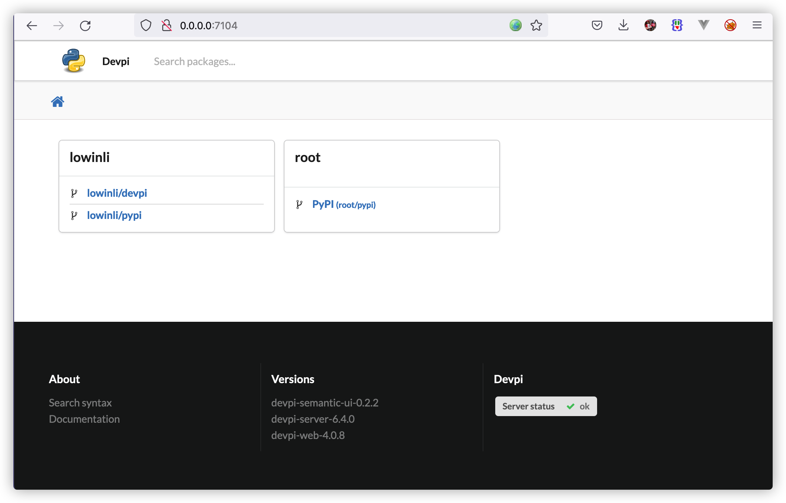
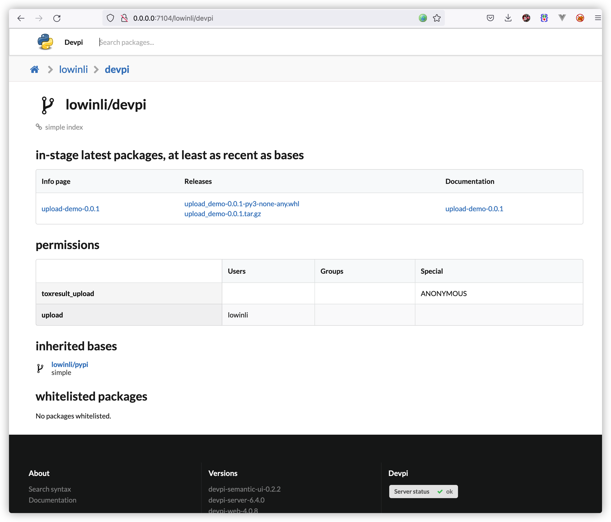
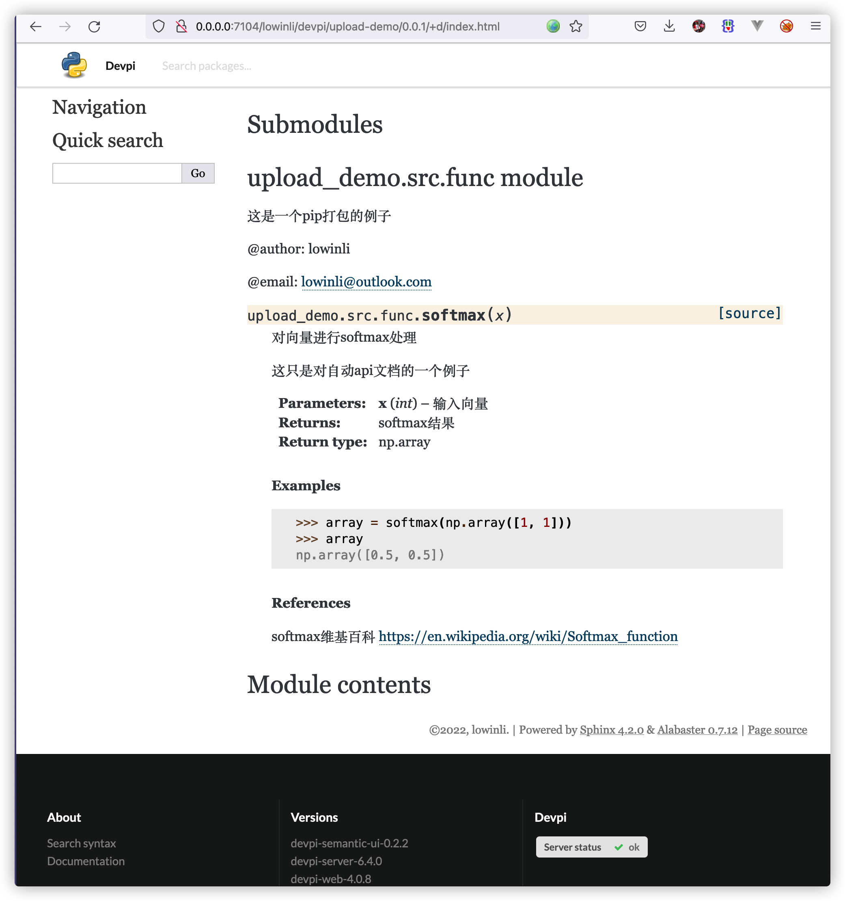
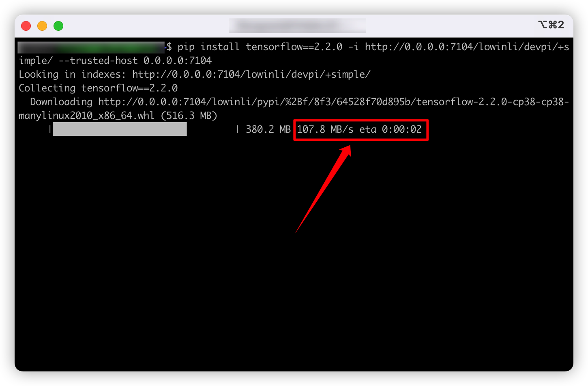

# docker启devpi服务

- [docker启devpi服务](#docker启devpi服务)
  - [1.简要](#1简要)
  - [2.背景](#2背景)
      - [2.1.为什么要自己搭建pypi源服务](#21为什么要自己搭建pypi源服务)
      - [2.2. pip源工具对比](#22-pip源工具对比)
  - [3.快速开始](#3快速开始)
      - [3.1. docker run 方式](#31-docker-run-方式)
      - [3.2. docker-compose 方式](#32-docker-compose-方式)
      - [3.3. 访问devpi页面](#33-访问devpi页面)
      - [3.4. 本地pip安装实验](#34-本地pip安装实验)
  - [4. 本项目特点](#4-本项目特点)
  - [5. 目录介绍](#5-目录介绍)
  - [6. 截图](#6-截图)


## 1.简要

+ [devpi工具](https://devpi.net/docs/devpi/devpi/stable/%2Bd/index.html)相比其他pypi源工具，有如下特点：
  1. **节省硬盘**：不必完全同步下来公开源的所有包，仅在第一次pip安装时从公开源下载和缓存。
  2. **支持上传接口文档**：上传自己开发pip库时，可以把接口文档也上传到devpi。

+ 本项目旨在用docker容器启动devpi服务。

## 2.背景
#### 2.1.为什么要自己搭建pypi源服务
1. **节省安装时间**：当我们在内网打包镜像、安装python环境时，经常要**反复**从**外网源**下载pip库。即使改用国内的阿里源、豆瓣源，下载速度一般也只会在**2~7MB/s**左右，如果安装500MB的TensorFlow，下载+安装约需要2分钟。如果遇到网络不稳定，等待时间会更长，而从内网下载安装包，速度在**100+MB/s !!!**。
2. **分享沉淀python库**：内部开发的python库，如果在内部pip源平台上，以pip库的形式内部分享，可以减少很多重复性工作，也可以沉淀工作内容。

#### 2.2. pip源工具对比

比较试用了几款常见的pip源工具，选择**devpi**工具搭建
| 工具                                                   | 上传自己的pip包至服务    | 外网源同步至服务                       | 安装体验                                                                          |
|--------------------------------------------------------|--------------------------|----------------------------------------|-----------------------------------------------------------------------------------|
| [pypiserver](https://github.com/pypiserver/pypiserver) | 支持twine命令上传        | 不支持，需要自己下载                   | 手动同步上千个包后index目录变卡                                                   |
| [bandersnatch](https://github.com/pypa/bandersnatch)   | 不支持命令上传包         | 自动同步，只能同步国外官方源，占硬盘多 | 白名单设置同步库较麻烦                                                            |
| [devpi](https://github.com/devpi/devpi)                | 支持twine、devpi命令上传 | 采用缓存机制，不占用太多硬盘           | 第一次客户端pip安装，服务会从指定外网源下载，并存入服务硬盘，后面直接走缓存的硬盘 |


## 3.快速开始
#### 3.1. docker run 方式

```bash
docker run -d --name devpi-lib -p 7104:7104  --env DEVPISERVER_HOST=0.0.0.0 --env DEVPISERVER_PORT=7104 --env DEVPISERVER_ROOT_PASSWORD=password --env DEVPISERVER_USER=lowinli --env DEVPISERVER_PASSWORD=password --env DEVPISERVER_MIRROR_INDEX=pypi --env DEVPISERVER_LIB_INDEX=devpi --env SOURCE_MIRROR_URL=https://pypi.douban.com/simple --restart always --volume volume:/var/lib/devpi lowinli98/devpi:v0.1
```

#### 3.2. docker-compose 方式

```yaml
version: "2.3"
services:
  devpi-lib:
    container_name: devpi-lib
    image: lowinli98/devpi:v0.1
    expose:
      - 7104
    ports:
      - "7104:7104"
    environment:
      - DEVPISERVER_HOST=0.0.0.0
      - DEVPISERVER_PORT=7104
      - DEVPISERVER_ROOT_PASSWORD=password
      - DEVPISERVER_USER=lowinli
      - DEVPISERVER_PASSWORD=password
      - DEVPISERVER_MIRROR_INDEX=pypi                    # 指定镜像index
      - DEVPISERVER_LIB_INDEX=devpi                      # 指定上传index
      - SOURCE_MIRROR_URL=https://pypi.douban.com/simple # 指定镜像源
    restart: always
    volumes:
      - ./volume:/var/lib/devpi

```

#### 3.3. 访问devpi页面
http://0.0.0.0:7104

#### 3.4. 本地pip安装实验
+ 单次安装
```bash
pip install tensorflow==2.2.0 -i http://0.0.0.0:7104/lowinli/devpi/+simple/ --trusted-host 0.0.0.0:7104
```

+ 修改默认pip安装源
```vim
# vim ./pip/pip.conf
[global]
index-url = http://0.0.0.0:7104/lowinli/devpi/+simple/
trusted-host = 0.0.0.0:7104
```

## 4. 本项目特点

1. 可以自由指定MIRROR源，尤其配置大陆pypi源可以提高搜索和下载速度，环境变量：`SOURCE_MIRROR_URL`
2. 通过索引继承方式，对MIRROR的index`DEVPISERVER_MIRROR_INDEX`和个人上传pip库的index`DEVPISERVER_LIB_INDEX`进行统一地址管理
3. 使用了[devpi-semantic-ui](https://github.com/apihackers/devpi-semantic-ui)页面，可以更好的展示pypi库的版本信息、接口文档
4. 在`examples/upload-demo`目录介绍一个例子，打包pip库、`sphnix`生成接口文档，并上传到devpi服务。

## 5. 目录介绍

+ 镜像构建目录
[./docker](./docker)
+ 打包pip包上传示例目录
[./examples/upload-demo](./examples/upload-demo)

## 6. 截图







